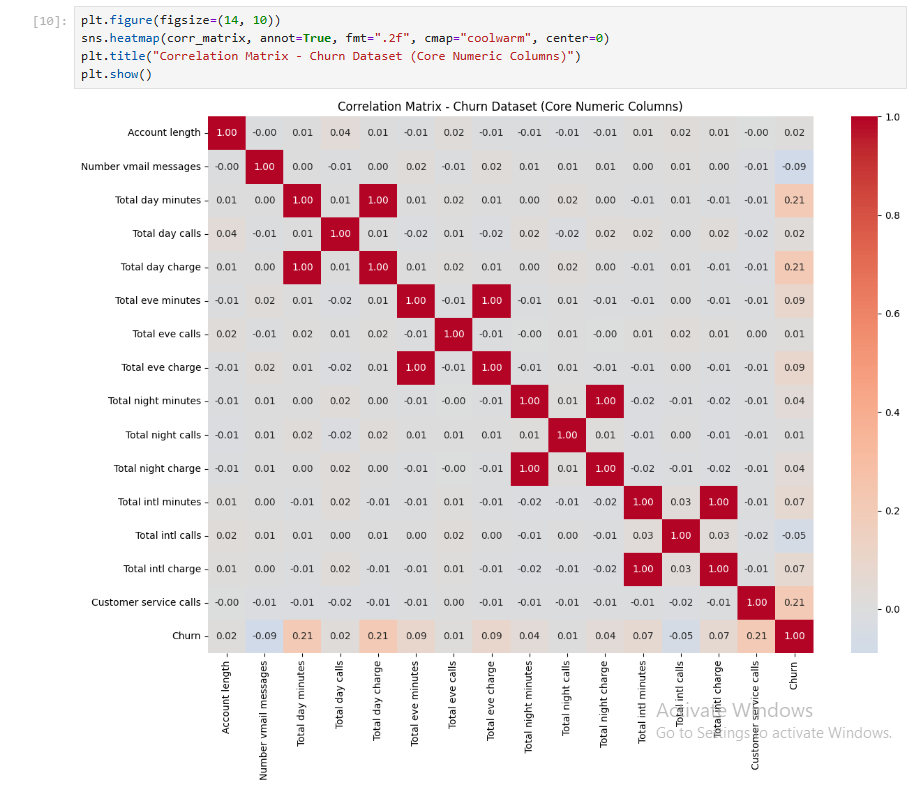
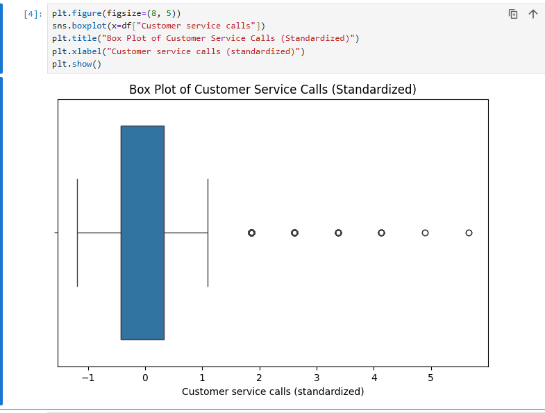
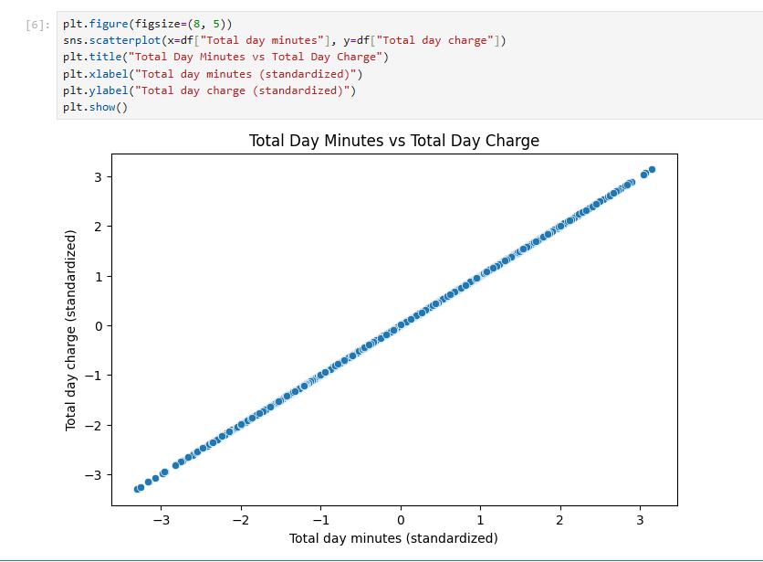
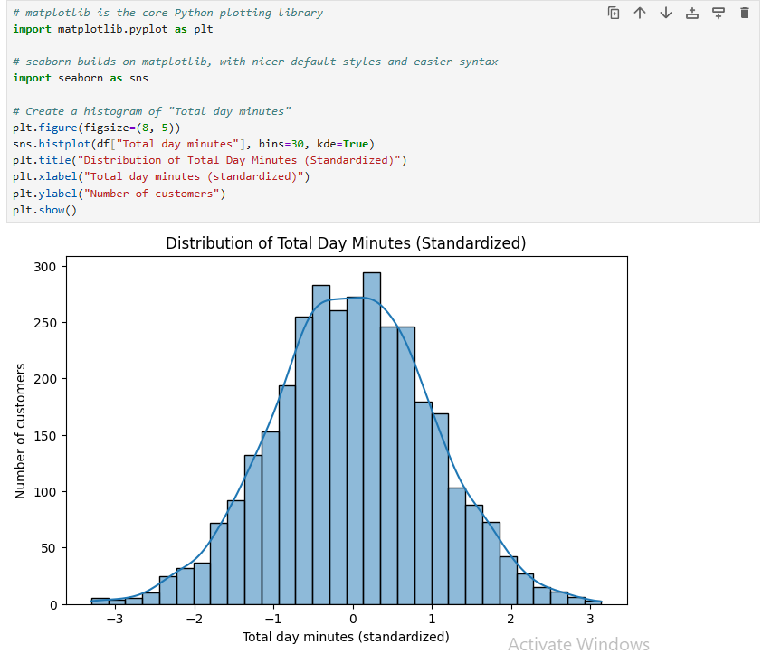

# 📊 EDA Insights Report - Codveda Churn Dataset

*Task 3 - Exploratory Data Analysis | Codveda Data Science Internship, Level 1*

---

## 📁 Dataset Overview

- 👥 **3,333 customers**, 70 columns after Task 2's cleaning and encoding (originally 20 columns before one-hot encoding State)
- 🚪 **~14.5% of customers churned** (left the company) - roughly 1 in 7 customers in this dataset
- 📏 All numeric columns (minutes, calls, charges, account length) were standardized in Task 2, so they now have a mean of 0 and standard deviation of 1 - this was independently re-confirmed during this task's summary statistics step

---

## 🔍 Key Finding 1: No Single Factor Strongly Predicts Churn

The correlation matrix shows that **no individual column has a strong relationship with Churn** - the highest correlations found were:
- ☎️ Customer service calls: **0.21**
- 🕐 Total day minutes / Total day charge: **0.21** each

All other columns showed weak or negligible correlation with Churn (mostly under 0.10). This suggests that churn is likely driven by a **combination of factors** working together, rather than any single dominant cause - a realistic finding for real-world customer behavior.

*Correlation matrix heatmap - the faint Churn row confirms no single strong predictor exists.*

---

## ☎️ Key Finding 2: Customer Service Calls Is the Strongest Available Signal

Customer service calls has the strongest correlation with Churn of any column in the dataset (0.21). This supports a judgment call made during Task 2's data cleaning: when 267 statistically "unusual" rows were found in this column using the IQR method, they were deliberately **kept rather than removed**, based on the reasoning that frequent customer service calls likely reflect genuine customer frustration - a pattern that could plausibly connect to churn.

✅ This EDA finding provides real evidence supporting that earlier decision.

*Box plot confirming the 267 outlier rows found in Task 2 - visible here as individual dots beyond the whisker.*

---

## 🔗 Key Finding 3: Several Column Pairs Are Near-Perfect Duplicates

The following column pairs showed correlations of **0.999+** with each other:
- 🕐 Total day minutes ↔ Total day charge
- 🌆 Total eve minutes ↔ Total eve charge
- 🌙 Total night minutes ↔ Total night charge
- ✈️ Total intl minutes ↔ Total intl charge

This makes sense operationally - "charge" in each case is calculated directly from "minutes" at a fixed rate. This is a case of **multicollinearity**: including both columns of a pair in a future predictive model would likely be redundant, since they carry almost identical information. Worth revisiting when building models in Level 2.

*Near-perfect linear relationship between Total day minutes and Total day charge - visual proof of the 1.00 correlation.*

---

## 🔔 Key Finding 4: "Total Day Minutes" Follows a Clean, Normal Distribution

A histogram of Total day minutes showed a smooth, symmetric bell-curve shape, centered at 0 (as expected after standardization), with no skew or multiple peaks. This indicates that most customers use a fairly typical, predictable amount of daytime call minutes, with progressively fewer customers at the low and high extremes.

*A textbook bell-curve shape - no skew, no unusual bumps.*

---

## 📦 Key Finding 5: Outliers in Customer Service Calls Are Real But Sparse in Value

The box plot above visually confirmed the 267 outlier rows identified in Task 2's IQR analysis. However, since the column only contains whole numbers, those 267 rows are spread across just **6 distinct outlier values** (4 through 9 calls) - meaning many customers share the exact same "extreme" value. A useful reminder: a box plot shows *which* values are extreme, not *how many* rows share them.

---

## 🚀 Recommendations for Next Steps (Level 2)

1. 🚫 **Avoid multicollinearity** - when building predictive models, don't include both columns from any of the near-duplicate pairs (e.g. use only "Total day charge," not both it and "Total day minutes")
2. 🎯 **Promising features** - Customer service calls, Total day minutes/charge, and Total eve minutes/charge appear to be the most promising individual features for predicting churn, based on their (comparatively) higher correlations
3. 🤖 **Model choice** - since no single feature is strongly predictive alone, a model that can combine multiple weak signals (such as logistic regression or a tree-based model) is likely to perform better than relying on any one feature in isolation

---

## 🛠️ Tools Used
`Python` · `pandas` · `matplotlib` · `seaborn` · `Jupyter Notebook`

---
*📌 This report was generated as part of Task 3 (Exploratory Data Analysis) of the Codveda Data Science Internship, based on the cleaned dataset produced in Task 2.*