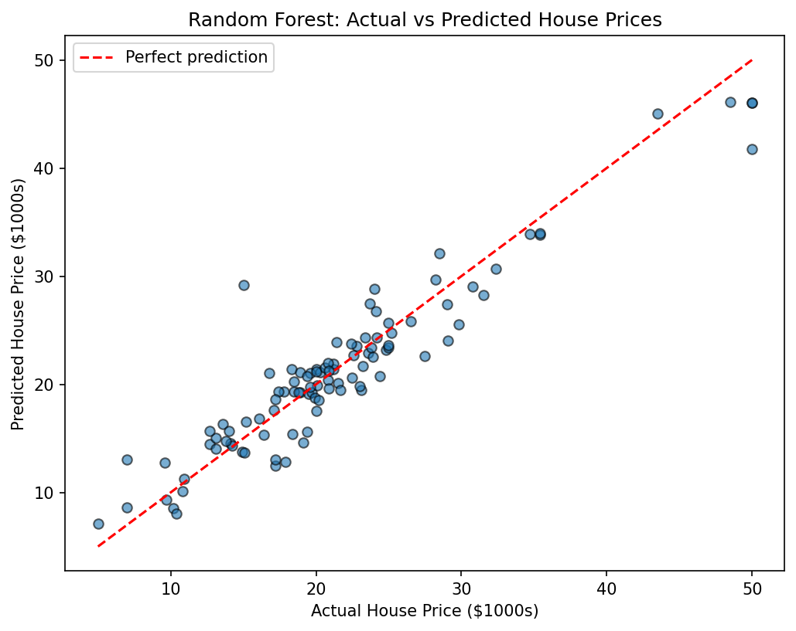

# 📈 Regression Report - Predicting House Prices

*Level 2, Task 1 - Predictive Modeling (Regression) | Codveda Data Science Internship*

---

## 🏠 Dataset Overview

- 🏘️ **506 houses**, 13 input features, from the classic Boston Housing dataset
- 🎯 **Target:** MEDV - median house value, in $1000s (range: $5,000 - $50,000, average ≈ $22,500)
- ✅ Confirmed 0 missing values and 0 duplicate rows before modelling
- ⚠️ The raw file had no headers and was space-separated (not comma-separated, despite the .csv extension) - fixed using `header=None`, custom column names, and `sep=r"\s+"`

---

## 🔀 Train/Test Split

The data was split into:
- **Training set:** 404 houses (80%)
- **Testing set:** 102 houses (20%)

This ensures the model is evaluated only on houses it has never seen, giving an honest measure of how well it would perform on new, real-world data.

---

## 📊 Model Comparison

Three models were trained and evaluated on the same test set:

| Model | MSE | R² | RMSE |
|---|---|---|---|
| Linear Regression | 24.29 | 0.669 | $4,929 |
| Decision Tree | 17.82 | 0.757 | $4,221 |
| **Random Forest** | **7.88** | **0.893** | **$2,807** |

🏆 **Random Forest performed best across every metric** - explaining ~89% of the variation in house prices, with predictions typically within ~$2,807 of the actual price.

---

## 🖼️ Visualization: Actual vs Predicted Prices (Random Forest)

*Each dot represents one house in the test set. The red dashed line represents a perfect prediction (actual = predicted). Most dots cluster tightly around this line, visually confirming the strong R² score.*

---

## 🔍 Key Insights

1. 📈 **Non-linear relationships matter** - both tree-based models (Decision Tree, Random Forest) outperformed Linear Regression, suggesting house prices don't follow a simple straight-line relationship with features like crime rate, rooms, or distance to jobs.
2. 🌲 **Ensembles beat single models** - Random Forest's approach of averaging 100 different trees produced more accurate and stable predictions than any single Decision Tree.
3. ⚠️ **Weaker performance at the extremes** - the model was noticeably less accurate for the cheapest and most expensive houses in the dataset, a known limitation of tree-based models when there are fewer training examples at the extremes.

---

## 🚀 Recommendations / Next Steps

- Consider tuning Random Forest's hyperparameters (e.g. number of trees, max depth) to see if performance improves further.
- Investigate the houses with the largest prediction errors individually - they may share characteristics not captured by the current 13 features.
- Compare against additional models (e.g. Gradient Boosting) in future iterations.

---

## 🛠️ Tools Used
`Python` · `pandas` · `numpy` · `scikit-learn` (LinearRegression, DecisionTreeRegressor, RandomForestRegressor, train_test_split, metrics) · `matplotlib` · `Jupyter Notebook`

---
*📌 This report was generated as part of Level 2, Task 1 (Predictive Modeling - Regression) of the Codveda Data Science Internship.*