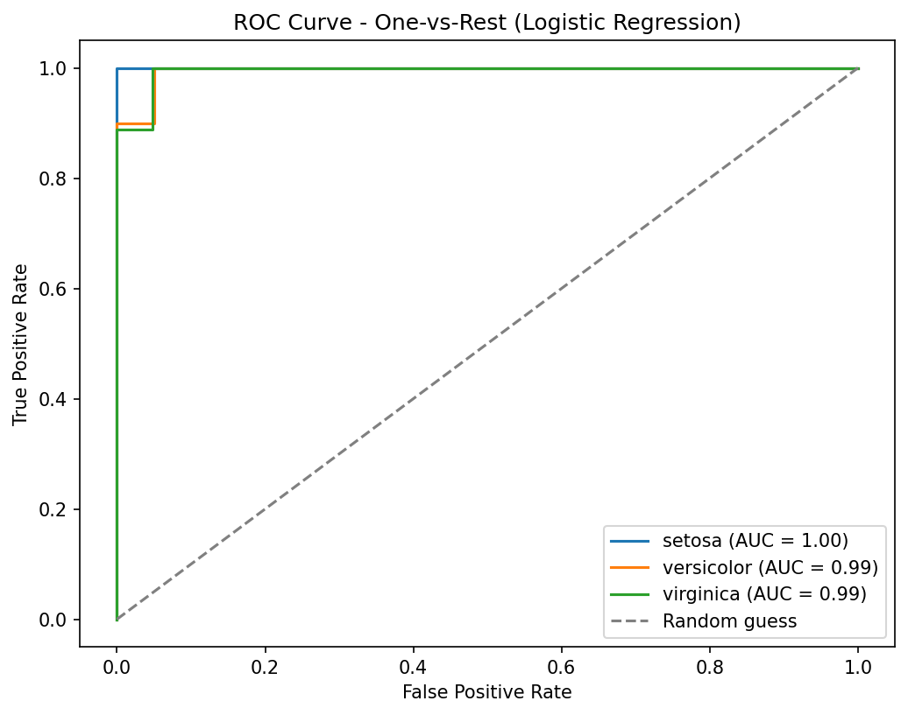

# 🌸 Classification Report - Iris Species Prediction

*Level 2, Task 2 - Classification | Codveda Data Science Internship*

---

## 🌼 Dataset Overview

- 🌸 **147 flowers** (after removing 3 exact duplicates from the original 150), 4 numeric measurements, 3 species
- 🎯 **Target:** species (setosa, versicolor, virginica)
- ✅ Confirmed 0 missing values before modelling

---

## 🧩 Preprocessing

- **species** → Label encoded (setosa=0, versicolor=1, virginica=2), appropriate since this is the target column, not an input feature
- **sepal_length, sepal_width, petal_length, petal_width** → Standardized using StandardScaler

---

## 📊 Model Comparison

| Model | Accuracy |
|---|---|
| **Logistic Regression** | **96.7%** |
| Random Forest | 93.3% |
| SVM | 93.3% |

🏆 **Logistic Regression performed best** - on this small, cleanly-separated dataset, the added flexibility of Random Forest and SVM wasn't necessary.

---

## 🔍 Per-Species Performance (Logistic Regression)

| Species | Precision | Recall | F1-score |
|---|---|---|---|
| setosa | 1.00 | 1.00 | 1.00 |
| versicolor | 1.00 | 0.90 | 0.95 |
| virginica | 0.90 | 1.00 | 0.95 |

**Insight:** setosa is perfectly separable from the other two species. The model's only apparent mistake likely confused one real versicolor flower for virginica - consistent with these two species being known to be visually more similar to each other than to setosa.

---

## 🖼️ ROC Curve (One-vs-Rest)

*All three species show curves hugging the top-left corner, with AUC scores of 1.00 (setosa), 0.99 (versicolor), and 0.99 (virginica) - confirming excellent separability, especially for setosa.*

---

## 🚀 Recommendations / Next Steps

- Since Logistic Regression already performs excellently, further model complexity is unlikely to help on this dataset.
- The one recurring confusion (versicolor vs virginica) suggests these two species could benefit from additional distinguishing features if more data were available.

---

## 🛠️ Tools Used
`Python` · `pandas` · `scikit-learn` · `matplotlib` · `Jupyter Notebook`

---
*📌 This report was generated as part of Level 2, Task 2 (Classification) of the Codveda Data Science Internship.*