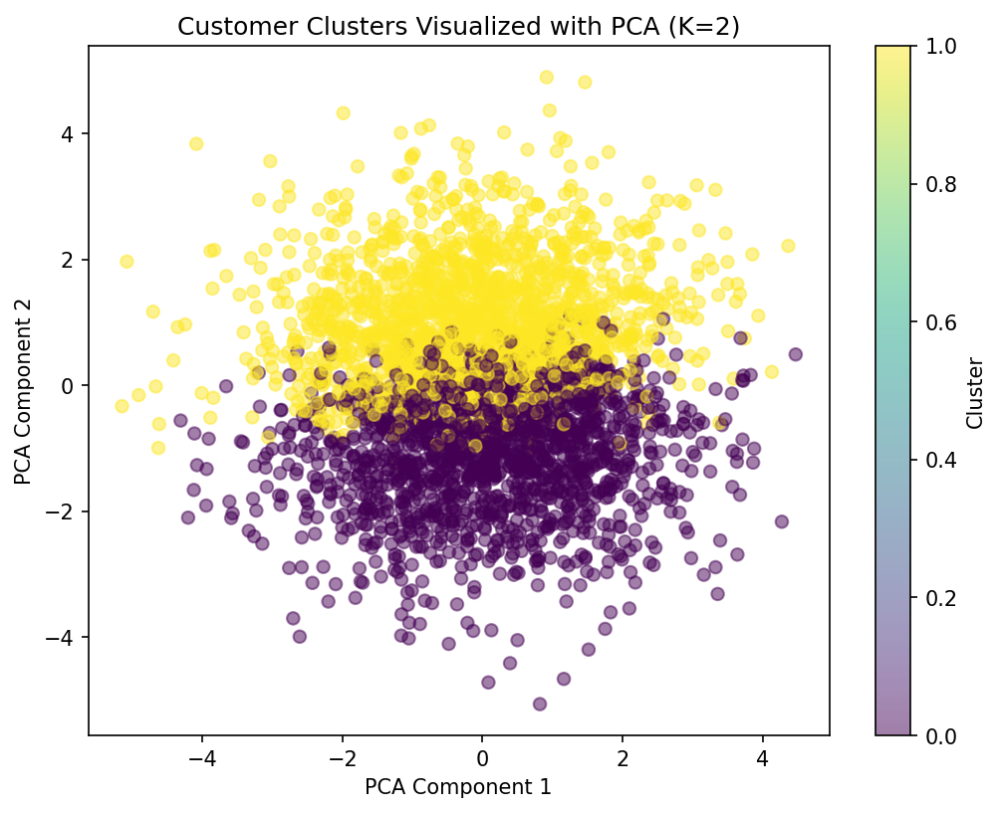

# 🧩 Clustering Report - Customer Segmentation

*Level 2, Task 3 - Clustering (Unsupervised Learning) | Codveda Data Science Internship*

---

## 👥 Dataset Overview

- 📞 **3,333 customers**, clustered using 15 behavioural/usage columns (minutes, calls, charges, account length, customer service calls)
- 🚫 Deliberately excluded Churn (the known outcome) and 51 one-hot encoded State columns (geography, not behaviour)
- 📏 All clustering columns were already standardized from Task 2 (Level 1)

---

## 🔢 Choosing the Number of Clusters (K)

Both the elbow method and silhouette score were used to select K:

- **Elbow method:** no sharp, obvious bend - inertia decreased smoothly from K=2 to K=10, suggesting no dramatically distinct number of natural groups
- **Silhouette score:** highest at K=2 (0.0848), though notably low overall (well below ~0.5, the threshold generally associated with strong, well-separated clusters)

**Decision:** proceeded with K=2, while being transparent that overall cluster separation is weak.

---

## 🖼️ Visualizing the Clusters (PCA)

*Clusters reduced to 2 dimensions using PCA (27.2% of total variance captured). The heavy overlap between clusters visually confirms the weak silhouette score - customers form one blended cloud with a rough tendency toward two groups, rather than two clearly separated islands.*

---

## 🔍 Interpreting the Two Clusters

Comparing average behaviour between clusters revealed a clear, interpretable pattern:

| Cluster | Day/Evening Usage | Night Usage | Label |
|---|---|---|---|
| Cluster 1 | Above average | Below average | 🌞 Daytime/Evening Users |
| Cluster 0 | Below average | Above average | 🌙 Night Owls |

Other columns (account length, voicemail messages, international usage, customer service calls) showed little difference between the two clusters - **timing of usage**, not overall volume or tenure, is the main distinguishing factor found.

---

## 🚀 Key Findings & Recommendations

1. 📊 **Weak but real structure** - the clusters found represent a genuine behavioural tendency (day/evening vs night usage), but the separation is gradual, not sharp. Customers should be thought of as existing on a spectrum rather than falling into hard categories.
2. 🌙 **A "Night Owl" segment exists** - this could be useful for targeted offers (e.g. night-specific plans or promotions) even though the segment isn't rigidly defined.
3. 🔬 **Future work** - trying clustering with a different column selection (e.g. including plan subscriptions), or testing other clustering algorithms (e.g. DBSCAN, which doesn't assume clusters are round/evenly sized) could reveal stronger structure than K-Means found here.

---

## 🛠️ Tools Used
`Python` · `pandas` · `scikit-learn` (KMeans, PCA, silhouette_score) · `matplotlib` · `Jupyter Notebook`

---
*📌 This report was generated as part of Level 2, Task 3 (Clustering) of the Codveda Data Science Internship.*