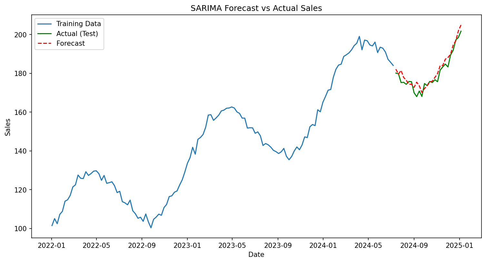

# ⏳ Time Series Report - Sales Forecasting

*Level 3, Task 1 - Time Series Analysis | Codveda Data Science Internship*

---

## 📁 Dataset Overview

- 📅 3 years of daily sales data (2022-2024), 1,096 days
- 🧪 Synthetic dataset, deliberately built from a known trend, yearly seasonality, and random noise, after a real data source (Stooq) proved inaccessible without a CAPTCHA-gated API key
- 📉 Resampled to 158 weekly points for SARIMA modelling, to keep computation practical

---

## 🔍 Decomposition Results

Using `seasonal_decompose` (additive, period=365), the series was split into:
- **Trend:** a smooth, steady climb from ~115 to ~185 over the 3 years
- **Seasonal:** a clean, repeating yearly wave (~±20), peaking mid-year and dipping later in the year
- **Residual:** random noise with no visible pattern, consistent with the random component built into the data

All three matched the known synthetic "ground truth" almost exactly, confirming the decomposition tool works as expected.

---

## 📉 Smoothing Techniques

Both a 30-day moving average and exponential smoothing (span=30) closely tracked the true underlying pattern, with very similar results to each other in this dataset, since there were no sudden shocks for the two methods to react differently to.

---

## 🔮 SARIMA Forecast

- **Model:** SARIMAX, order=(1,1,1), seasonal_order=(1,1,1,52) (weekly data)
- **Training:** 132 weeks | **Testing:** 26 weeks (held out, in chronological order)
- ⚠️ Note: an EstimationWarning was raised due to having only ~2.5 seasonal cycles of training data - a genuine limitation, though it did not meaningfully harm forecast accuracy in this case

*Forecast (red dashed) closely tracks actual sales (green) across the 26-week test period, including the dip and the sharp late upswing.*

---

## 📏 Evaluation

**RMSE: 2.93** - on average, forecasts were off by less than 3 sales units, against actual values ranging roughly 170-205 in the test period (about 1-2% relative error).

---

## 🚀 Key Findings & Recommendations

1. 📈 **Strong forecast accuracy**, despite the seasonal data limitation - the model's trend component appears to have carried most of the forecasting power.
2. ⚠️ **More historical data would strengthen the seasonal estimate** - ideally 4+ full yearly cycles, rather than 2.5, to more confidently estimate the seasonal parameters.
3. 🔬 **Future work:** apply this same pipeline to a real dataset (e.g. manually downloaded stock or sales data) to validate these techniques outside of a synthetic, "known-answer" setting.

---

## 🛠️ Tools Used
`Python` · `pandas` · `numpy` · `statsmodels` · `scikit-learn` · `matplotlib` · `Jupyter Notebook`

---
*📌 This report was generated as part of Level 3, Task 1 (Time Series Analysis) of the Codveda Data Science Internship.*