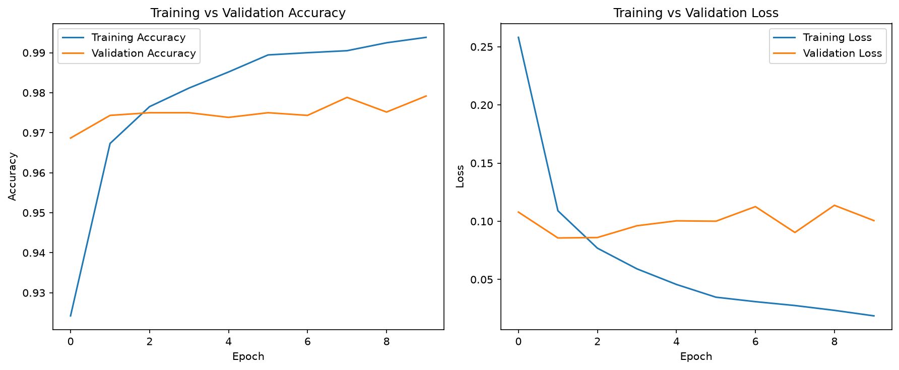

# 🧠 Neural Network Report - MNIST Digit Classification

*Level 3, Task 3 - Neural Networks with TensorFlow/Keras | Codveda Data Science Internship*

---

## 📁 Dataset Overview

- 🔢 **MNIST handwritten digits**: 60,000 training images, 10,000 testing images, each 28x28 pixels, grayscale
- 📏 Pixel values normalized from 0-255 to 0-1
- 📐 Images flattened from 28x28 grids into single rows of 784 numbers

---

## 🏗️ Architecture

| Layer | Neurons | Activation | Parameters |
|---|---|---|---|
| Hidden Layer 1 | 128 | ReLU | 100,480 |
| Hidden Layer 2 | 64 | ReLU | 8,256 |
| Output Layer | 10 | Softmax | 650 |
| **Total** | | | **109,386** |

---

## 🏋️ Training Results

- **Optimizer:** Adam | **Loss:** Sparse categorical crossentropy | **Batch size:** 32 | **Epochs:** 10
- **Final test accuracy: 97.77%**, final test loss: 0.089

*Training accuracy/loss kept improving through all 10 epochs, while validation accuracy plateaued and validation loss slightly worsened after epoch 2-3, a clear, visual sign of overfitting.*

---

## 🎛️ Hyperparameter Tuning Attempt

Based on the overfitting pattern observed, a second model was trained with only 3 epochs instead of 10, hypothesizing this would reduce overfitting and maintain or improve test accuracy.

| Model | Epochs | Test Accuracy |
|---|---|---|
| Original | 10 | **97.77%** |
| Tuned (fewer epochs) | 3 | 96.98% |

**Result:** the tuned model performed slightly worse, not better. Reviewing the original training curves showed validation accuracy was still slowly, unevenly improving even during the epochs where the training/validation gap was visible, stopping at epoch 3 cut training short before reaching a slightly better later point.

---

## 🔍 Key Findings

1. 🧠 A relatively simple 3-layer neural network achieved strong performance (97.77%) on handwritten digit recognition with minimal architecture tuning.
2. 📈 Overfitting was clearly visible by comparing training vs validation curves, a growing gap between the two is a reliable visual signal.
3. ⚠️ A reasonable-seeming fix (fewer epochs) did not straightforwardly improve results, demonstrating that hyperparameter tuning benefits from systematic methods (e.g. early stopping, which monitors validation performance directly) rather than a single manual guess.

---

## 🚀 Recommendations for Future Work

1. Implement Keras' EarlyStopping callback to automatically halt training at the true best validation point, rather than manually guessing a fixed epoch count.
2. Experiment with regularization techniques (e.g. Dropout layers) to reduce overfitting while still training for more epochs.
3. Try a Convolutional Neural Network (CNN) architecture, which is generally better suited to image data than a fully-connected network like the one used here.

---

## 🛠️ Tools Used
`Python` · `TensorFlow` · `Keras` · `numpy` · `matplotlib` · `Jupyter Notebook`

---
*📌 This report was generated as part of Level 3, Task 3 (Neural Networks) of the Codveda Data Science Internship - the final task of the internship.*